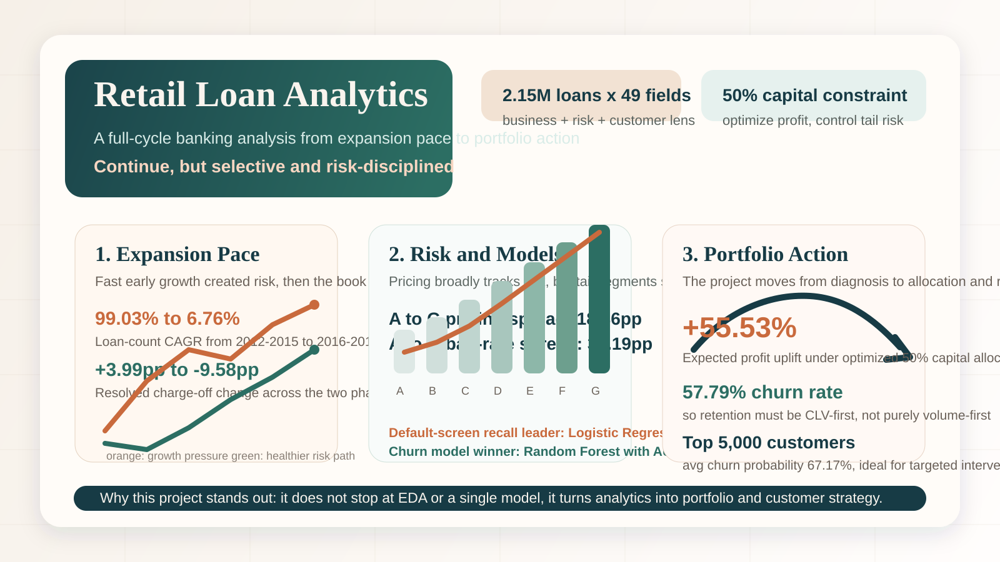

# Retail Loan Analysis

This project evaluates a retail lending business from six connected angles: growth pace, risk pricing, credit screening, data quality, portfolio optimization, and churn retention. The analysis is designed to answer a management question rather than just a modeling question:

**Should the bank continue expanding its retail loan business, and if so, under what operating model?**

The overall conclusion is yes, but with a more selective, risk-disciplined, and analytics-driven strategy.

## Project Snapshot

- Main file: `DA5107_Submission_Complete.ipynb`
- Format: self-contained, report-ready notebook
- Scope: business analysis, credit risk, portfolio strategy, and customer retention
- Dataset scale: 2,147,635 rows and 49 columns

## Why This Project Stands Out

- It goes beyond EDA and single-model evaluation. The notebook connects analytics to real lending decisions.
- It combines business strategy and quantitative modeling in one narrative.
- It treats risk, profitability, capital allocation, and retention as one integrated system.
- It does not force one model to solve every problem. Different models are used for different business objectives.

## Key Findings

### 1. Expansion was initially too aggressive, then became more sustainable

From 2012 to 2015, the loan book expanded very quickly:

- Loan count CAGR: `99.03%`
- Loan amount CAGR: `107.36%`
- Resolved charge-off change: `+3.99pp`

From 2016 to 2018, growth slowed and realized risk improved:

- Loan count CAGR: `6.76%`
- Loan amount CAGR: `11.33%`
- Resolved charge-off change: `-9.58pp`

This suggests the bank corrected from growth-first expansion toward a healthier pace.

### 2. Pricing is directionally risk-aligned, but tail risk remains undercompensated

- Average pricing spread from grade A to G: `18.36pp`
- Average bad-rate spread from grade A to G: `33.19pp`

Higher-risk borrowers are charged higher rates, which is directionally correct. But the increase in default risk is steeper than the increase in pricing, especially in weaker segments, so yield quality should be monitored more carefully than headline margin.

### 3. The project uses models with business intent, not just technical accuracy

For bad-borrower screening under a recall-priority policy:

- `Logistic Regression` achieved `Recall_bad = 0.8667`
- `Random Forest` achieved higher `AUC = 0.7481`, but lower bad-borrower recall

For churn prediction:

- Selected model: `Random Forest`
- Churn model `AUC = 0.9047`
- Churn model `Recall = 0.9897`

This is a strong project choice: the analysis does not pretend one metric or one model is always best. It matches evaluation to the decision context.

### 4. Portfolio optimization is tied to capital reality

Under a `50%` funding constraint:

- Baseline expected profit: `4,503,927,727`
- Optimized expected profit: `7,004,906,850`
- Profit uplift: `+55.53%`
- Profit-to-risk improvement: `+10.79%`

This turns the project from descriptive analysis into an actionable allocation framework.

### 5. Retention is prioritized by value, not just churn volume

- Overall churn rate: `57.79%`
- Top CLV-priority segment size: `5,000`
- Average churn probability of top-priority customers: `67.17%`

Instead of treating every exit the same way, the project recommends CLV-first intervention, especially for renewal and refinancing opportunities among stronger borrowers.

### 6. Data quality is treated as a management issue

The notebook does not ignore messy operational data. It explicitly flags structural missingness and consistency problems, including:

- `annual_inc_joint` missing in `94.66%` of records
- `mths_since_last_record` missing in `84.11%` of records
- schema drift and cross-field consistency risks

That makes the project more realistic, because real credit analytics only work when governance improves alongside modeling.

## Business Recommendation

The final recommendation is not to stop lending, but to run the portfolio with tighter discipline:

- grow more selectively
- price with stronger tail-risk awareness
- use model outputs together with policy rules
- optimize allocations by risk-adjusted return, not volume
- build CLV-based retention programs instead of blanket churn prevention
- strengthen data governance before scaling further automation

## Methods Used

- Exploratory business and risk trend analysis
- Credit-grade and pricing relationship analysis
- Recall-priority default modeling
- Churn prediction and CLV-based prioritization
- Data quality profiling
- Portfolio optimization under capital constraints

## Repository Contents

- `DA5107_Submission_Complete.ipynb`: full integrated analysis notebook
- `project_highlights_overview.svg`: visual summary for GitHub and presentation use
- `README_EN.md`: project overview

## How To Review

1. Open `DA5107_Submission_Complete.ipynb`.
2. Read the notebook in section order for the full management narrative.
3. Use the overview figure above if you want a quick summary before diving into the details.

## Portfolio Framing

If this project is presented in a portfolio, its strongest story is:

**not just "I built a model," but "I used analytics to decide how a lending business should grow, price risk, allocate capital, and retain valuable customers."**
